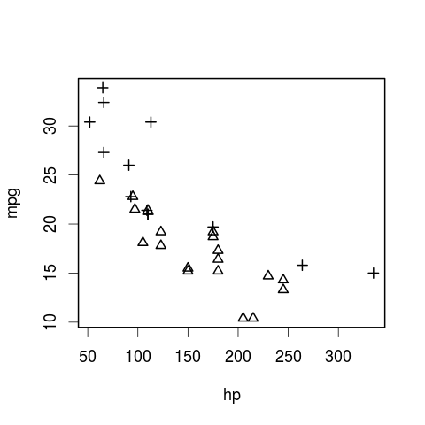

# Multiple Regression

In the ANOVA and simple regression models that we have run so far, most of them have been a single response/dependent variable as a function of a single predictor/independent variable. But in many cases we know that there are several things that could reasonably influence the response variable. For example, species and sex could both affect sparrow size; age and sex could both influence running time.

It is straightforward to include multiple predictors. We start with the simple, special case of Analysis of Covariance (ANCOVA), which includes one categorical and one continuous predictor. Multiple linear regression can include any number of categorical and continuous predictors.


# Analysis of Covariance (ANCOVA)

Statisticians realised early on that ANOVA was merely the beginning of analysing experiments---other factors apart from the experimental treatment might influence the response variable they were interested in. 

This issue is especially pertinent when considering change, i.e., does our experimental treatment affect growth or survival? Here, the starting point of each sample is important. If we are measuring growth of seedlings, how big that seedling is at the start of the experiment will have a big affect on its growth. Moreover, if by chance all the big seedlings ended up in one treatment and the small ones in another, we may erroneously assign significance to the treatment.

Thus, analysis of variance with a continuous covariate was born, and we can ask if our treatment had a significant effect, accounting for the measured variation in seedling initial size, for example.

An ANCOVA is able to test for differences in **slopes** and **intercepts** among regression lines: 

 - A difference in **intercept** suggests a differences in magnitude but not in the rate of change, i.e., the regression lines are parallel.

 - A difference in **slope** suggests a difference in the rate of change, i.e., the regression lines are not parallel. 


## Functions

 - `aov()` or `lm()`,

 - `anova()`.


## Example: car mpg

We will illustrate ANCOVA with the `mtcars` dataset that comes with R.

```
data(mtcars)
head(mtcars)
```

```
                   mpg cyl disp  hp drat    wt  qsec vs am gear carb
Mazda RX4         21.0   6  160 110 3.90 2.620 16.46  0  1    4    4
Mazda RX4 Wag     21.0   6  160 110 3.90 2.875 17.02  0  1    4    4
Datsun 710        22.8   4  108  93 3.85 2.320 18.61  1  1    4    1
Hornet 4 Drive    21.4   6  258 110 3.08 3.215 19.44  1  0    3    1
Hornet Sportabout 18.7   8  360 175 3.15 3.440 17.02  0  0    3    2
Valiant           18.1   6  225 105 2.76 3.460 20.22  1  0    3    1
```

The data was extracted from the 1974 _Motor Trend_ US magazine, and comprises fuel consumption and 10 aspects of automobile design and performance for 32 automobiles (1973-74 models).

A data frame with 32 observations on 11 variables:

       [, 1]  mpg   Miles/(US) gallon                        
       [, 2]  cyl   Number of cylinders                      
       [, 3]  disp  Displacement (cu.in.)                    
       [, 4]  hp    Gross horsepower                         
       [, 5]  drat  Rear axle ratio                          
       [, 6]  wt    Weight (1000 lbs)                        
       [, 7]  qsec  1/4 mile time                            
       [, 8]  vs    V/S                                      
       [, 9]  am    Transmission (0 = automatic, 1 = manual) 
       [,10]  gear  Number of forward gears                  
       [,11]  carb  Number of carburetors    


The `mpg` of a car can depend on a number of variables, including the transmission type (`am`) and horse power (`hp`). 

We will model mpg as a function of hp and am and ask if am has a significant effect.

Thus, we take `mpg` as the response variable, `hp` as the predictor variable and `am` as the categorical variable.




### How to specify the ANCOVA models

Use ` * ` to indicate the interaction between the categorical variable and the covariate.

Put the continuous variable first. This is because R conducts the ANOVA tests sequentially, thus removing (or accounting) for the effect of `hp` before testing for differences between `am`.

```
m1 <- aov(mpg ~ hp * am, data = mtcars)
summary(m1)
```

```
            Df Sum Sq Mean Sq F value   Pr(>F)    
hp           1  678.4   678.4  77.391 1.50e-09 ***
am           1  202.2   202.2  23.072 4.75e-05 ***
hp:am        1    0.0     0.0   0.001    0.981    
Residuals   28  245.4     8.8  
```

The summary shows that horse power and transmission type have significant effects on miles per gallon (the p-values are less than 0.05), but the interaction is not significant.


Next, run the additive model (use ` + `).

```
m0 <- aov(mpg ~ hp + am, data = mtcars)
summary(m0)
```

```
            Df Sum Sq Mean Sq F value   Pr(>F)    
hp           1  678.4   678.4   80.15 7.63e-10 ***
am           1  202.2   202.2   23.89 3.46e-05 ***
Residuals   29  245.4     8.5   
```

Both horse power and transmission type have a significant effect on miles per gallon.


### How to compare the models


We can compare m0 and m0 with the `anova()` function to assess if removing the interaction significantly affects the fit of the model.

```
anova(m1, m0)
```

```
Analysis of Variance Table

Model 1: mpg ~ hp * am
Model 2: mpg ~ hp + am
  Res.Df    RSS Df  Sum of Sq     F Pr(>F)
1     28 245.43                           
2     29 245.44 -1 -0.0052515 6e-04 0.9806
```

This shows that removing the interaction does not significantly affect the fit of the model (F = 6e-04, p = 0.98). 

Therefore, we conclude that the most parsimonious model is m0, the additive model. The interaction between horse power and transmission type is not significant. 

So mpg will respond similarly to variation in horse power for both automatic and manual cars.


### Plotting the lines


# Multiple Linear Regression


