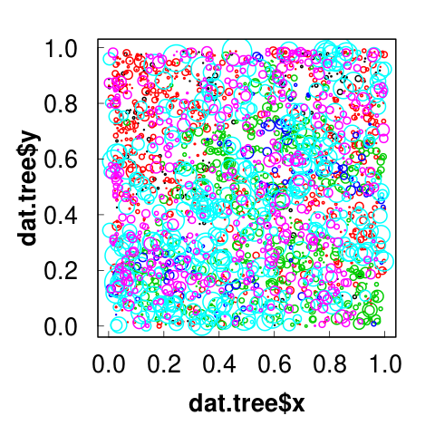
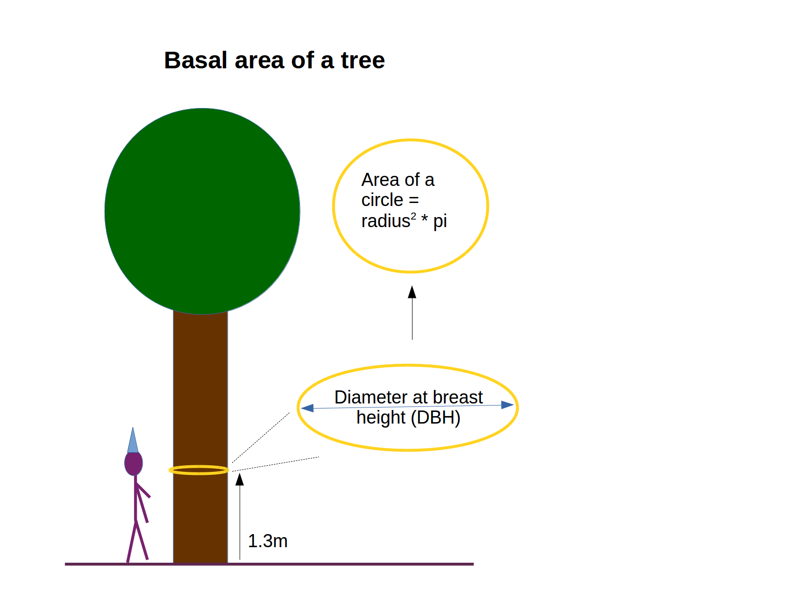

# Unit 5. Graphics: Labs

These labs test and build on the material presented in the SWIRL lessons.

Scroll down or click [here](../unit5/labs.html#how-to-submit-your-labs) to to check how to submit them.


 - - -
 
## Lab 1

Using the sparrow data set.

```r
dat <- read.table(file = "http://www.intro2r.info/data/sparrows.txt", header = TRUE)
```

### 1. Create a plot with 4 panels (2 x 2).

The panels should show the following barplots:

 - top left, the number of males and females of species SESP
 - top right, the number of males and females of species SSTS
 - bottom left, the number of individuals in each species that are male
 - bottom right, the number of individuals in each species that are female

To help aid comparisons, make sure that the y axes for the two plots in each row have the same range.

Each panel should have x and y axis labels in bold.


### 2. For species SSTS, make a three-panel horizontal figure.

Plot Tarsus, Head, and Weight each as a function of Sex in separate panels.

Ensure that males and females are different colours.

Each panel should have the lines wider than the default width and horizontal y-axis numbers.


### 3. Make a five-panel plot.

Plot Wingcrd as a function of Tarsus, Head, Culmen, Weight, and Nalospi, differentiating each species by colour and/or symbol.

Ensure that the tick marks point inwards and the axis labels have units (you can make up what the units are).


 - - -
 
## Lab 2
 
Using the sparrow data set.

```r
dat <- read.table(file = "http://www.intro2r.info/data/sparrows.txt", header = TRUE)
```

### 1. Calculate the mean Head size and Tarsus size for both species x sex combination.

### 2. Make a 2-panel figure of two boxplots.

 - plot Tarsus as a function of sex in one panel, and plot Head as a function of sex in the other. 
 
 - Make sure that each sex has a consistent color.

### 3. Plot the data again, but instead of boxplots, use stripcharts to illustrate all the data points. 

 - Superimpose the mean values on top and add error bars. 
 
 - Ensure that the data points are paler and the summary data stand out. Check the bestiary for details on stripcharts.

### 4. Plot Head as a function of Tarsus.

 - Ensure that the points for each sex and species are different but consistent (e.g., circles for species 1, squares for species 2, empty for males, filled for females). 
 
 - Make some good use of colour!

 
- - -

## Lab 3

## Tree plot in Michigan 



*Trees in a 1-ha plot on East Lansing, MI, USA. Colours indicate different species; size of symbol indicates DBH.*

```r
# Read in the data
dat_tree <- read.table("http://www.intro2r.info/data/treespecies_cleandata.txt", 
                       header = TRUE, sep = '\t')
```




1. Write a function to calculate basal area (remember that BA = radius^2 * pi).

2. Calculate the basal area of each tree.

3. Calculate the total BA of all trees.

4. Using `tapply()`, calculate the mean BA of each species 

5. Using one call to `tapply()` what is the total BA of (i) alive trees, and (ii) dead trees?

6. Write a function to generate a map (an x-y plot) of the trees. Set some nice defaults. Establish a 2 x 3 grid of panels in a figure, and use this function to make a map of each species.

- - -


## Lab 4 & Recap: More Trees!

### 1. Write a loop to read in each of the following six files, one for each species.

You can either read them in from the URLs, or download them to your hard drive and read them in from there.

There are several ways to do this.

Think about what data object/s you want to create.

You might want to use `paste()`. 

```
http://www.intro2r.info/data/blackoak.txt
http://www.intro2r.info/data/hickory.txt
http://www.intro2r.info/data/maple.txt
http://www.intro2r.info/data/misc.txt
http://www.intro2r.info/data/redoak.txt
http://www.intro2r.info/data/whiteoak.txt
```

### 2. Write a loop to make the same 2 x 3 panel figure of maps as for Lab 3 Q6.
 
 - Use your custom plotting function from Lab 3.

 - Make sure to use a loop!


### 3. Create six random tree communities of 100 trees from the full trees dataset

 - Use `sample()`.
 
 - Create a list, and have each element of this list be a community.
 
 - Plot the six communities. Ensure that point size is proportional to DBH.
 
 - Calculate the mean DBH of each community.


- - -
 
# How to submit your labs

## How to write up your lab answers

You will need to write R code to answer each of the questions.

Please format your answers as follows:

 - Copy and paste each question, commented out. This ensures that we know which answer corresponds to which question.

  - Write your R code answer below each question.

It should look something like this:

```
# LAB: Unit 1. Lab 1
# Your Name #  Put your name here

# 1. Add 7 and 3,456.
7 + 3456

# 2. Assign this value to an object
x <- 7 + 3456
```

## How to submit your lab answers on Canvas

 - Log into Canvas.

 - Go to the Assignments page.

 - Under ‘Labs’, you should find the correct assignment.

 - Copy and paste your R code into the text box.

 - Click ‘Submit Assignment’.

You are permitted to submit your answers as many times as you like within each Unit.

Answers will be graded two or three times a week and re-opened if you submit early.

Each lab will close at its respective deadline (see Canvas).

Final grades for each lab will be computed and entered into the Canvas gradebook at the end of each Unit.


