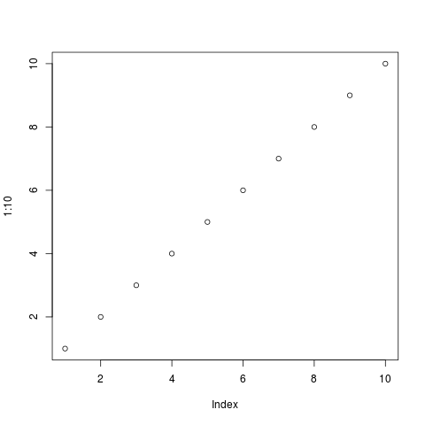
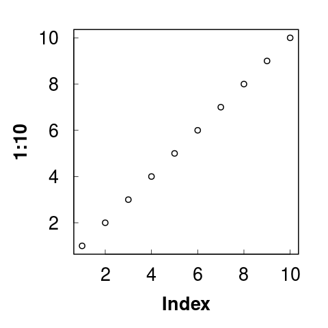

# Functions 
==========


# Functions vs Objects: Reprise

## Functions are **tools**

```
mean()

sum()

sd()
```


# A. Why write your own functions?

1. To perform specific tasks for your own work

2. To set specific defaults to other functions

3. Avoid repetition of large chunks of code


E.g., set defaults for nice plots




```r
plot(1:10)
```




```r
par(lwd = 2, tcl = 0.3, 
    font.lab = 2, las = 1, 
    cex = 1.5, cex.lab = 1.5, cex.axis = 1.5, 
    mar = c(5,5,2,2))
plot(1:10)
```


## 1. Functions are an abstraction


```r
# Calculate the mean of your data

sum(my.data) / length(my.data)
```


### We can separate **what** we want to do from how we do it.

```r
# Function to calculate mean
my.mean <- function(x){
  sum(x) / length(x)
}

# Calculate mean of my data
my.mean(my.data)
```


## 2. Functions make code more readable

This code is shorter but harder to understand

```r
data$response.logit <- log(data$response / (1 - data$response))
```


This code is more lines, but:

  - separates the *what* from the *how*,

  - is more reliable.

  
```r
logit <- function(p){
  log(p / (1-p))
}

data$response.logit <- logit(data$response)
```


## 3. Functions help avoid coding errors

- Functions are self-contained (e.g., do not depend on global variables)

- Limit the *scope* of variables, because they are contained within function body.


## 4. Functions help you become more productive

- Enable easy re-use of code.

- Project becomes more modular and easy to change.


# B. How functions work

1. Take an object

2. Perform an action/s

3. Return another object or output


## The structure of a function


1. **Name:** Can be any valid name. Do not write over existing functions. Follow style guide to function names.

2. **Input arguments:** What are the inputs or data to the function? As many inputs as you want.

3. **Actions:** What do you want the function to do with the inputs? Create a plot? Calculate a statistic? Run a regression analysis? 

4. **Action arguments:** Are there any options and/or defaults you want to set?

5. **Output:** What output or final product do you want? A scalar? A vector? A dataframe? A plot? A table?


## Structure of a function: Code

```r
# The basic structure of a function

NAME <- function(ARGUMENTS) {


  ACTIONS


  return(OUTPUT) # Optional

}
```


## An example function

```r
# Create the function my.mean()

my.mean <- function(x) {   # Single input called x

  output <- sum(x) / length(x) # Calculate output

return(output)  # Return output to the user after running the function

}
```

## Or ..

```r
# Create the function my.mean()

my.mean <- function(x) {   # Single input called x

 sum(x) / length(x) # Calculate output

}
```


## Abstracting Functions

Problem: e.g., Calculate mean DBH of trees


### i. Directly using the data

```r
sum(dat_tree$DBH) / length(dat_tree$DBH)
```

### ii. Turn this into a function

```r
my_mean <- function(dat_tree$DBH){

  sum(dat_tree$DBH) / length(dat_tree$DBH)

}
```


### iii. Abstract it

```r
my_mean <- function(x){

  sum(x) / length(x)

}
```


## Functions within functions

You can call functions from within functions.

We already did this in the function above, where we used sum() and length().

```r
my_mean <- function(x){

  sum(x) / length(x)

}
```


#### e.g., return SD and mean tree DBH

```r
meanSD <- function(x){

  out <- c( my_mean(x), sd(x) )

  return(out)

}
```


## Adding to the basic structure

- Multiple inputs

- Set defaults


## Save and `source()` your functions

- Store your functions in a new `customFunctions.R ` file.

- Use `source()` to load that file into R

```r
source("customFunctions.R")
```


# Build and test functions

- Build functions step-by-step.

- Test each line.

- Test full function on known inputs.


 
# C. Function design

## 1. A function should do one thing well

 


## 2. A function should be easily understandable in isolation
 


## 3. Style Guide for Functions


### 1. Use verbs for function names ...


```r
# Good

checkNames()

calcBA()


# Bad
nameChecker()

baCalculator()
```


### ... a different style from variables


```r
# Variables

names_original

names_checked

tree_dbh

tree_ba

```


### 2. Indent multiple lines to where definition starts

```r
# Good

checkNames <- function(x, 
                   names_correct = 'file-of-correct-names.txt'
                   ) {
  # Code of function body goes here, indented
    
}


# Bad

checkNames <- function(x, 
  names_correct = 'file-of-correct-names.txt') {
  # Here it is hard to tell the arguments from the code body
}


```


### 3. No line breaks within assignments


```r
# Good

calcCarbon <- function(dbh, height, 
                   genus = 'Quercus')


# Bad

calcCarbon <- function(dbh, height, genus =
                  'Quercus')


```


###  4. Use comments to explain **why**, not *what* or *how*
 
Each line of comment should begin with a hash and a single space.
 
```r 
# A comment explains why
 
```
 

### 5. Function documentation

There are many ways to document your functions.

It should include:

 - Describe the function.
 - List and describe the arguments, including data type.
 - Describe what is returned.
 
 - Comments should be sufficient and separate from the code.


```r
# One example

funcName <- function(x, a, b, 
                   arg1 = 'bananas',
                   arg2 = 6.45) {
# A short description of what the function does  
#
# Arguments:
# Followed by a list of the arguments and description
#   x: data from ..., numeric
#   a: something, numeric 
#   b: something else, numeric
#   arg1: type of fruit, character
#   arg2: a constant modifier, numeric
#
# Returns:
#   The total biomass of fruit in a forest

  code body here
  
}
```

